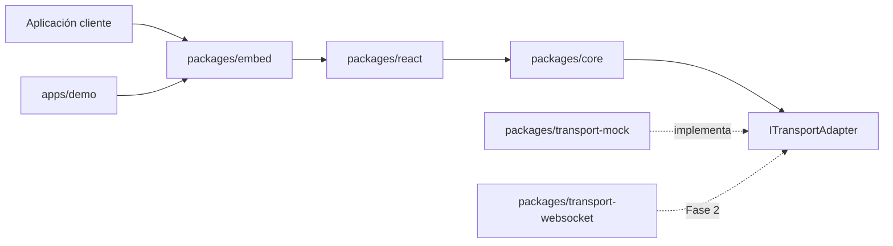

# AGIChat Widget SDK

SDK de chat embebible para incorporar una interfaz conversacional en aplicaciones web. El proyecto separa el dominio, la presentación y los transportes para que el backend simulado de esta fase pueda reemplazarse sin modificar el widget.

## Funcionalidades

- Widget React accesible y adaptable a distintos tamaños de pantalla.
- Web Component `<agi-chat-widget>` para sitios que no utilizan React.
- API imperativa para integraciones que necesitan controlar el montaje.
- Mensajes del agente renderizados como Markdown seguro.
- Transporte mock con estados de escritura, respuestas diferidas, error y timeout.
- Tema visual personalizable mediante propiedades tipadas.
- Cobertura mínima del 80% aplicada por paquete.
- Pipeline de GitHub Actions para lint, build, tipos, pruebas y cobertura.

## Arquitectura

El repositorio utiliza una arquitectura de puertos y adaptadores. `packages/core` concentra el dominio y declara `ITransportAdapter`; las implementaciones externas cumplen ese contrato y pueden intercambiarse sin acoplar el motor del chat a una tecnología de red.



Esta separación permite:

- Probar la lógica conversacional sin navegador ni servidor.
- Desarrollar la interfaz utilizando respuestas deterministas.
- Sustituir el mock por WebSocket en la siguiente fase.
- Distribuir una API estable para React y otra independiente del framework.

## Requisitos

- Node.js 22.
- Corepack habilitado.
- pnpm 11.19.0, definido en `packageManager`.

## Instalación

```bash
git clone https://github.com/Juanjoo-Alvarez/ChatAgent_IA.git
cd ChatAgent_IA
corepack enable
pnpm install --frozen-lockfile
```

## Ejecutar la demostración

```bash
pnpm dev:demo
```

Vite mostrará la dirección local de la aplicación. La demo contiene escenarios de soporte, ventas e incorporación, además de mensajes sugeridos para probar el transporte simulado y la respuesta `42` del wireframe.

Para generar una versión estática:

```bash
pnpm --filter @agichat/demo build
pnpm --filter @agichat/demo preview
```

## Uso del SDK

### Web Component

Después de cargar el bundle ESM, el componente se registra automáticamente:

```html
<script type="module" src="/assets/agichat-widget.js"></script>

<agi-chat-widget
  title="Soporte"
  session-id="cliente-123"
  placeholder="Escribe tu consulta…"
  empty-state-message="¿Cómo podemos ayudarte?"
></agi-chat-widget>
```

El bundle IIFE `agichat-widget.iife.js` ofrece la misma etiqueta para páginas que utilizan scripts clásicos.

### API imperativa

```ts
import { mountChatWidget } from "@agichat/embed";
import { MockTransportAdapter } from "@agichat/transport-mock";

const transport = new MockTransportAdapter();

const unmount = mountChatWidget("#chat", {
  transport,
  title: "Asistente de producto",
  sessionId: "sesion-demo"
});

// Cuando la página deje de necesitar el widget:
unmount();
transport.dispose();
```

### Tema personalizado

Las propiedades no especificadas conservan los valores del tema predeterminado:

```ts
const widget = document.querySelector("agi-chat-widget");

if (widget !== null) {
  widget.theme = {
    accent: "#0f766e",
    headerBackground: "linear-gradient(135deg, #134e4a, #0f766e)",
    userBubbleBackground: "#0f766e"
  };
}
```

## Comandos de desarrollo

| Comando | Descripción |
| --- | --- |
| `pnpm dev:demo` | Inicia la aplicación de demostración. |
| `pnpm lint` | Verifica las reglas de estilo. |
| `pnpm build` | Compila todos los paquetes y aplicaciones en orden de dependencias. |
| `pnpm typecheck` | Comprueba los tipos de producción y pruebas. |
| `pnpm test` | Ejecuta todas las pruebas. |
| `pnpm test:coverage` | Ejecuta pruebas y valida cobertura mínima del 80%. |
| `pnpm release:prepare` | Genera los artefactos locales de distribución. |

El build debe ejecutarse antes del typecheck global porque los paquetes resuelven declaraciones internas desde `dist`.

## Estructura del repositorio

```text
.
├── apps/
│   └── demo/                    # Aplicación y casos de uso de ejemplo
├── packages/
│   ├── core/                    # Dominio, estado y puertos
│   ├── react/                   # Widget, componentes, hook y tema
│   ├── embed/                   # Web Component y API de montaje
│   ├── transport-mock/          # Respuestas simuladas para desarrollo
│   └── transport-websocket/     # Adaptador preparado para la Fase 2
├── docs/                        # Documentación especializada
├── scripts/                     # Automatización del repositorio
└── .github/workflows/           # Integración continua y releases
```

Para escalar el proyecto:

- Agrega reglas del negocio y nuevos contratos en `packages/core`.
- Agrega interfaces visuales y hooks reutilizables en `packages/react`.
- Agrega APIs de integración para sitios clientes en `packages/embed`.
- Crea cada transporte como `packages/transport-<nombre>` implementando `ITransportAdapter`.
- Crea aplicaciones ejecutables o ejemplos bajo `apps/<nombre>`.
- Coloca documentación extensa o decisiones técnicas en `docs/`.
- Expón la API pública de cada paquete desde su `src/index.ts`.

## Pruebas y calidad

Antes de abrir un pull request ejecuta:

```bash
pnpm lint
pnpm build
pnpm typecheck
pnpm test:coverage
```

Las pruebas se ejecutan con Vitest. Los paquetes configurados con cobertura deben mantener al menos 80% en líneas, ramas, funciones y statements. Las pruebas del widget utilizan React Testing Library y las del Web Component se ejecutan con jsdom.

## Flujo de contribución

El equipo utiliza GitHub Flow:

1. Actualiza `main` desde el remoto.
2. Crea una rama `feature/<paquete>-<tarea>`, `fix/<paquete>-<problema>` o `docs/<tema>`.
3. Implementa y valida el cambio localmente.
4. Abre un pull request hacia `main`.
5. Solicita al menos una aprobación.
6. Integra únicamente cuando el job `Quality gate` esté en verde.

No se permiten pushes directos a `main`. Consulta [AGENTS.md](./AGENTS.md) para las convenciones completas y [docs/RELEASING.md](./docs/RELEASING.md) para el proceso de distribución.
